# Custom Effect Pack (themanro)

A consolidated **library of 17 effects** for the Zoom MS-70CDR (ZDL family),
built on the [repeat98/ZoomMultistompZDL](https://github.com/repeat98/ZoomMultistompZDL)
toolchain. Ten are originals (each with a full-quality Python **desktop
preview** in `tools/audio_preview/renderers/`); the rest are rebuilt/renamed
Airwindows-derived ports. All are grouped under the **Delay** category with a
custom on-device cover, and all compile clean (`.fardata 0`, `0 relocations`).

> ⚠️ **Status:** partially hardware-tested on an MS-70CDR. Knob scaling, the
> Howl rewrite, the multi-knob path, and the TapeHack freeze-fix are confirmed;
> the renamed Airwindows ports (Spool/Oxide/Room/Lush) still need a play-test.
> The pedal **can't hold or run all 17 at once** (storage + DSP limits) —
> install a curated subset, back up first, flash one at a time.

## Pedal icons

<table>
<tr>
<td align="center">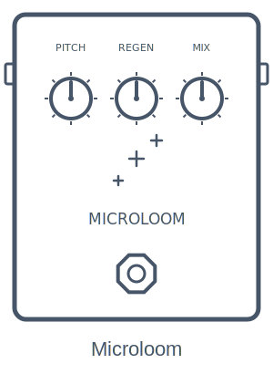</td>
<td align="center">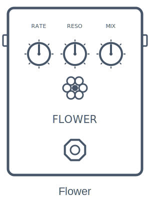</td>
<td align="center">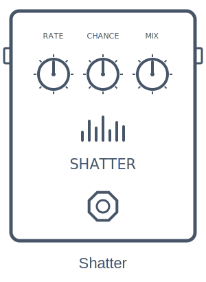</td>
<td align="center">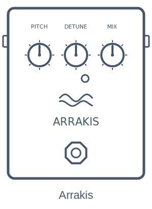</td>
</tr>
<tr>
<td align="center">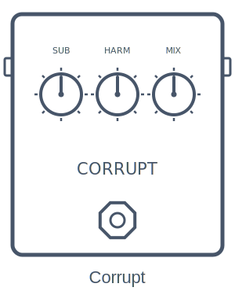</td>
<td align="center">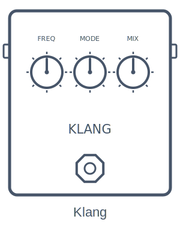</td>
<td align="center">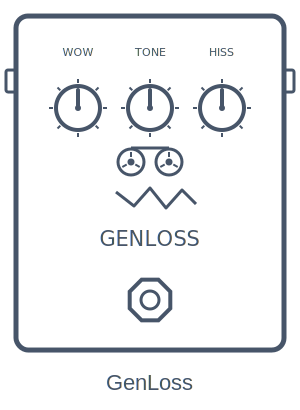</td>
<td align="center">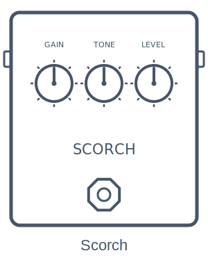</td>
</tr>
<tr>
<td align="center">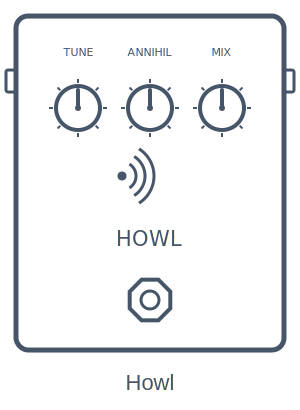</td>
<td align="center">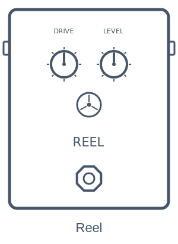</td>
<td align="center">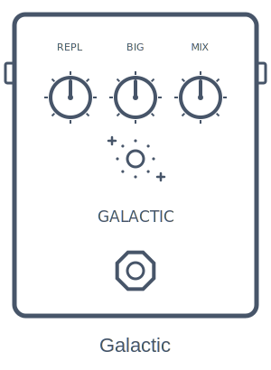</td>
<td align="center">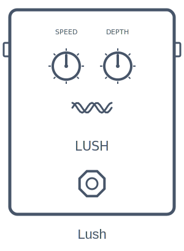</td>
</tr>
<tr>
<td align="center">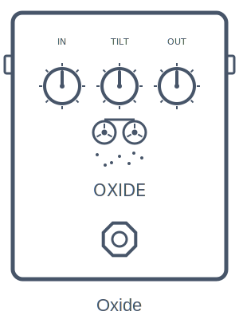</td>
<td align="center">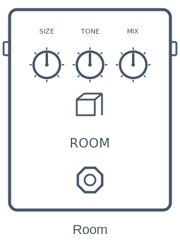</td>
<td align="center">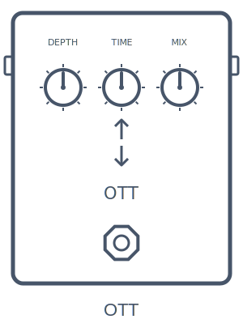</td>
<td align="center">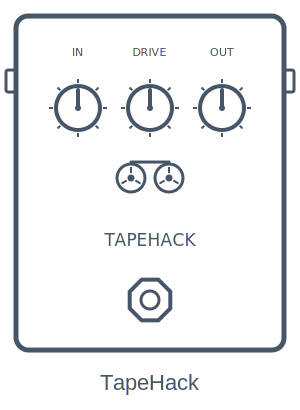</td>
</tr>
<tr>
<td align="center">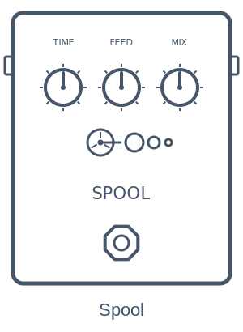</td>
</tr>
</table>

(Zoom Effect Manager-style icons. They use the Press Start 2P pixel font; in
GitHub's inline SVG preview the text may fall back to monospace.)

## The effects

All effects sit in the **Delay** category. "Origin" marks original DSP vs
rebuilt/renamed Airwindows-derived ports.

| Effect | `.ZDL` | Knobs | Origin | What it is |
|---|---|---|---|---|
| Microloom | `Microlm` | Pitch, Regen, Tone, Mix | original | granular pitch-shimmer cloud |
| Flower | `Flower` | Rate, Mix | original | Korg "Random" S&H step filter (Deftones "Digital Bath") |
| Shatter | `Shatter` | Chance, Mix | original | stutter / beat-repeat glitch for drums |
| Arrakis | `Arrakis` | Detune, Mix | original | Dune-style detuned sub-octave beating drone |
| Corrupt | `Corrupt` | Sub, Tone, Wave, Mix | original | EQD Data Corrupter-style PLL square synth |
| Klang | `Klang` | Freq, Mix | original | ring modulator |
| GenLoss | `GenLoss` | Wow, Tone, Hiss | original | tape/VHS generation-loss degradation |
| Scorch | `Scorch` | Gain, Level | original | aggressive high-gain amp + cab |
| Howl | `Howl` | Tune, Annihil, Level | original | DBA Total Sonic Annihilation-style self-oscillating feedback |
| Reel | `Reel` | Drive, Level | original | light tape saturation |
| Galactic | `Galactic` | 5 | port | lush Airwindows reverb |
| Lush | `Lush` | Speed, Depth | port | stereo chorus (Airwindows StereoChorus) |
| Oxide | `Oxide` | 9 | port | tape saturation/drive (Airwindows ToTape) |
| Room | `Room` | 5 | port | small reverb (Airwindows) |
| OTT | `OTT` | 4 | port | OTT-style multiband compressor |
| TapeHack | `TapeHack` | Input, Drive, Output | port | tape saturation (Airwindows; Output-knob freeze fixed) |
| Spool | `Spool` | 9 | port | tape echo (Airwindows-inspired) |

Some features are deferred on the originals (Klang's frequency-shifter modes,
GenLoss dropouts, Scorch's full cab IR) — see each effect's `manifest.json` vs
`manifest_pedal.json`.

## Sound previews

Rendered demos (click to play in GitHub's audio viewer). These are the
**desktop** renders — full-quality, before the 2-knob pedal reduction.

| Effect | Demo | Dry source |
|---|---|---|
| Microloom | [microloom.wav](previews/audio/microloom.wav) — lush shimmer wash | [chord](previews/audio/dry_chord.wav) |
| Flower | [flower.wav](previews/audio/flower.wav) — Digital Bath random filter | [chord](previews/audio/dry_chord.wav) |
| Shatter | [shatter.wav](previews/audio/shatter.wav) — machine-gun stutter | [drums](previews/audio/dry_drums.wav) |
| Arrakis | [arrakis.wav](previews/audio/arrakis.wav) — −2 oct beating drone | [drone](previews/audio/dry_drone.wav) |
| Corrupt | [corrupt.wav](previews/audio/corrupt.wav) — PLL square synth | [guitar](previews/audio/dry_guitar.wav) |
| Klang | [klang.wav](previews/audio/klang.wav) — metallic ring mod | [chord](previews/audio/dry_chord.wav) |
| GenLoss | [genloss.wav](previews/audio/genloss.wav) — wrecked tape | [chord](previews/audio/dry_chord.wav) |
| Scorch | [scorch.wav](previews/audio/scorch.wav) — djent high-gain amp+cab | [riff](previews/audio/dry_riff.wav) |
| Howl | [howl.wav](previews/audio/howl.wav) — self-oscillating feedback | [guitar](previews/audio/dry_guitar.wav) |

Regenerate or explore other presets with the preview tool below.

## Hearing them on desktop (no compiler, no pedal)

The renderers mirror each effect's DSP so you can audition before flashing:

```bash
pip install numpy scipy soundfile
python3 tools/audio_preview/make_test_signal.py input.wav        # or make_drum_loop.py
python3 tools/audio_preview/preview.py render scorch input.wav out.wav --set gain=85
python3 tools/audio_preview/preview.py list                      # all effects + coverage
```

## Building the pedal `.ZDL`

Requires the TI C6000 compiler (see the main README). The build scripts here
point `TI_ROOT` at `/Applications/ti/ti-cgt-c6000_8.5.0.LTS` — edit if yours
differs.

```bash
python3 build_all.py flower          # one effect -> dist/Flower.ZDL
python3 build_all.py scorch          # etc.
```

Pre-built `.ZDL` files for all eight are in [`dist/`](dist/).

## Implementation notes

All pedal builds follow the repo's safe-DSP rules: no math library (polynomial
sines, cubic soft-clips, reciprocal approximations, baked filter coefficients),
no runtime divide, persistent state in the `ctx[3]` arena, the `ctx[11]/ctx[12]`
magic shuttle preserved, and **no static arrays** (scalar float literals compile
to immediates and stay relocation-free; arrays would force a code→data
relocation, a documented freeze risk).

Licensing follows the parent repo (MIT for repo code).
