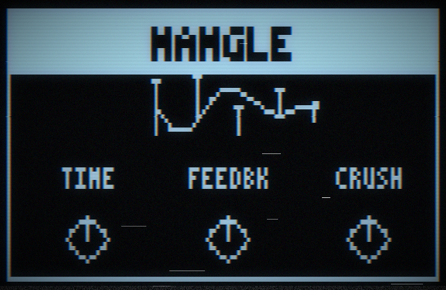
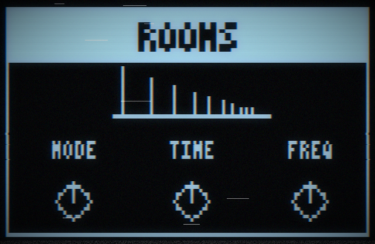
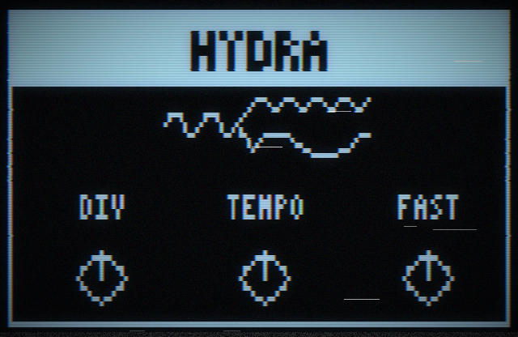
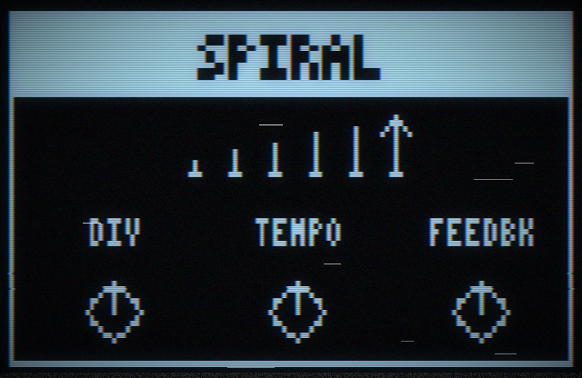

# Custom Effect Pack (themanro)

A curated **library of 18 effects** for the Zoom MS-70CDR (ZDL family),
built on the [repeat98/ZoomMultistompZDL](https://github.com/repeat98/ZoomMultistompZDL)
toolchain. Fifteen are originals (most with a full-quality Python **desktop
preview** in `tools/audio_preview/renderers/`); the rest are rebuilt/renamed
Airwindows-derived ports. All are grouped under the **Delay** category with a
custom on-device cover, and all compile clean (`.fardata 0`, `0 relocations`).

> ⚠️ **Status:** curated after hardware listening. **Mangle** is now a 6-knob
> blendable delay (Crush/Tremolo/Pitch), **Taffy** a 5-knob tape warp, and
> **Rooms** (new) is a multi-mode reverb — lightly hardware-checked so far.
> All volume knobs (Level/Output/Mix) default to **1** so nothing is loud at
> patch select — dial them up (in the Patch Editor, patches self-materialise on
> load; on the pedal's own footswitch you may need to nudge a knob once).
> **Custom fxids must not collide with any stock effect id** — the pedal keys
> effects by fxid alone, so a collision loads the wrong DSP (cracking/dead);
> `build/extract_effect_db.py` now guards against this. The pedal **can't hold
> or run all 18 at once** (storage + DSP limits) — install a subset, back up
> first, flash one at a time.

## Pedal icons

<table>
<tr>
<td align="center"></td>
<td align="center"></td>
<td align="center"></td>
<td align="center"></td>
</tr>
<tr>
<td align="center"></td>
<td align="center"></td>
<td align="center"></td>
<td align="center"></td>
</tr>
<tr>
<td align="center"></td>
<td align="center"></td>
<td align="center"></td>
<td align="center"></td>
</tr>
<tr>
<td align="center"></td>
<td align="center"></td>
<td align="center"></td>
<td align="center"></td>
</tr>
<tr>
<td align="center"></td>
<td align="center"></td>
<td></td><td></td>
</tr>
</table>

(These are renders of the actual 128×64 on-device cover images — lit pixels
on the pedal's LCD — generated by `src/airwindows/common/custom_covers.py`.)

> Note: these covers control the **pedal's screen** only. Zoom Effect
> Manager's browser thumbnails come from the app's internal database of
> stock effects, so custom effects always show its generic pedal icon —
> that's an app limitation, not a bug in these files.

## The effects

All effects sit in the **Delay** category. "Origin" marks original DSP vs
rebuilt/renamed Airwindows-derived ports.

| Effect | `.ZDL` | Knobs | Origin | What it is |
|---|---|---|---|---|
| Microloom | `Microlm` | Pitch, Regen, Tone, Mix | original | granular pitch-shimmer cloud |
| Flower | `Flower` | Rate, Mix | original | Korg "Random" S&H step filter (Deftones "Digital Bath") |
| Shatter | `Shatter` | Chance, Mix | original | stutter / beat-repeat glitch for drums |
| Arrakis | `Arrakis` | Detune, Mix | original | Dune-style detuned sub-octave beating drone |
| Corrupt | `Corrupt` | Sub, Tone, Wave, Mix | original | EQD Data Corrupter-style PLL square synth |
| Klang | `Klang` | Freq, Sweep, Mix | original | swept-carrier ring modulator (sirens, dive bombs) |
| GenLoss | `GenLoss` | Wow, Tone, Hiss | original | tape/VHS generation-loss degradation |
| Scorch | `Scorch` | Gain, Level | original | aggressive high-gain amp + cab |
| Howl | `Howl` | Tune, Annihil, Level | original | DBA Total Sonic Annihilation-style self-oscillating feedback |
| Taffy | `Taffy` | Speed, Chance, Depth, Glide, Mix | original | Red Panda Tensor-style tape warp: Speed anchors the head (reverse/stop/double), Depth/Chance add random slips, Glide sets motor smoothness |
| Dissolve | `Dissolve` | Chance, Smear, Glitch, Mix | original | OBNE Parting-style glitch delay dissolving into reverb wash |
| Mangle | `Mangle` | Time, Feedbk, Crush, Tremolo, Pitch, Mix | original | delay with three blendable per-repeat mutations: Crush (bitcrush/degrade) + Tremolo compound in the feedback, Pitch (octave-down grain) on the output |
| Rooms | `Rooms` | Mode, Time, Freq, Depth, Mix | original | DBA Rooms-inspired multi-mode reverb — Mode picks ROOM/DIGIT/PEAK/GATE/WAVE/GONG; Freq/Depth are re-purposed per mode |
| Hydra | `Hydra` | Window, Fast, Slow, Tone, Mix | original | two extra playback heads on one delay ring — a 2× (octave-up / double-time) and a 0.5× (octave-down / half-time) layer, re-triggered every Window. Short Window = granular pitch layers, long Window = rhythmic ghosts. Built for drums |
| Spiral | `Spiral` | Time, Feedbk, Rise, Glide, Span, Tone, Mix | original | delay whose repeats climb or sink — the pitch shift sits *inside* the feedback loop so it compounds. Rise = per-repeat staircase (bipolar, unity at centre); Glide + Span = a note resets a ramp to zero and it climbs over 0.2–8 s, so repeats start at pitch and drift away |
| Galactic | `Galactic` | 5 | port | lush Airwindows reverb (wet path boosted) |
| Oxide | `Oxide` | 9 | port | tape saturation/drive (Airwindows ToTape) |
| Spool | `Spool` | 9 | port | tape echo (Airwindows-inspired) |

Some features are deferred on the originals (Klang's frequency-shifter modes,
GenLoss dropouts, Scorch's full cab IR) — see each effect's `manifest.json` vs
`manifest_pedal.json`.

## Sound previews

Rendered demos (click to play in GitHub's audio viewer) for the effects that
have a desktop renderer. These are the **desktop** renders — full-quality,
before the pedal knob reduction.

| Effect | Demo | Dry source |
|---|---|---|
| Microloom | [microloom.wav](previews/audio/microloom.wav) — lush shimmer wash | [chord](previews/audio/dry_chord.wav) |
| Flower | [flower.wav](previews/audio/flower.wav) — Digital Bath random filter | [chord](previews/audio/dry_chord.wav) |
| Shatter | [shatter.wav](previews/audio/shatter.wav) — machine-gun stutter | [drums](previews/audio/dry_drums.wav) |
| Arrakis | [arrakis.wav](previews/audio/arrakis.wav) — −2 oct beating drone | [drone](previews/audio/dry_drone.wav) |
| Corrupt | [corrupt.wav](previews/audio/corrupt.wav) — PLL square synth | [guitar](previews/audio/dry_guitar.wav) |
| Klang | [klang.wav](previews/audio/klang.wav) — metallic ring mod | [chord](previews/audio/dry_chord.wav) |
| GenLoss | [genloss.wav](previews/audio/genloss.wav) — wrecked tape | [chord](previews/audio/dry_chord.wav) |
| Scorch | [scorch.wav](previews/audio/scorch.wav) — djent high-gain amp+cab | [riff](previews/audio/dry_riff.wav) |
| Howl | [howl.wav](previews/audio/howl.wav) — self-oscillating feedback | [guitar](previews/audio/dry_guitar.wav) |
| Hydra | [hydra.wav](previews/audio/hydra.wav) — double-time ghost + half-time drag | [drums](previews/audio/dry_drums.wav) |
| Spiral | [spiral.wav](previews/audio/spiral.wav) — slow 8-second rising delay | [guitar](previews/audio/dry_guitar.wav) |

Regenerate or explore other presets with the preview tool below.

## Hearing them on desktop (no compiler, no pedal)

The renderers mirror each effect's DSP so you can audition before flashing:

```bash
pip install numpy scipy soundfile
python3 tools/audio_preview/make_test_signal.py input.wav        # or make_drum_loop.py
python3 tools/audio_preview/preview.py render scorch input.wav out.wav --set gain=85
python3 tools/audio_preview/preview.py list                      # all effects + coverage
```

## Building the pedal `.ZDL`

Requires the TI C6000 compiler (see the main README). The build scripts here
point `TI_ROOT` at `/Applications/ti/ti-cgt-c6000_8.5.0.LTS` — edit if yours
differs.

```bash
python3 build_all.py flower          # one effect -> dist/Flower.ZDL
python3 build_all.py scorch          # etc.
```

Pre-built `.ZDL` files for all 18 are in [`dist/`](dist/).

## Implementation notes

All pedal builds follow the repo's safe-DSP rules: no math library (polynomial
sines, cubic soft-clips, reciprocal approximations, baked filter coefficients),
no runtime divide, persistent state in the `ctx[3]` arena, the `ctx[11]/ctx[12]`
magic shuttle preserved, and **no static arrays** (scalar float literals compile
to immediates and stay relocation-free; arrays would force a code→data
relocation, a documented freeze risk).

Licensing follows the parent repo (MIT for repo code).
