# Zoom MultiStomp ZDL

Custom `.ZDL` effects for Zoom MultiStomp pedals, plus the reverse-engineered
toolchain used to build them.

## Custom effect pack

This fork is a consolidated custom **library of 17 effects** — all grouped
under the Delay category, each with a custom on-device cover. Originals:
granular shimmer, drum glitch, tape degradation, a Dune-style drone, a Data
Corrupter-style synth, ring mod, high-gain amp+cab, a feedback howl, and tape
saturation. Plus rebuilt/renamed Airwindows-derived ports: reverbs, stereo
chorus, and tape. See [CUSTOM_EFFECTS.md](CUSTOM_EFFECTS.md) for details, knob
layouts, and sound demos.

<table>
<tr>
<td align="center">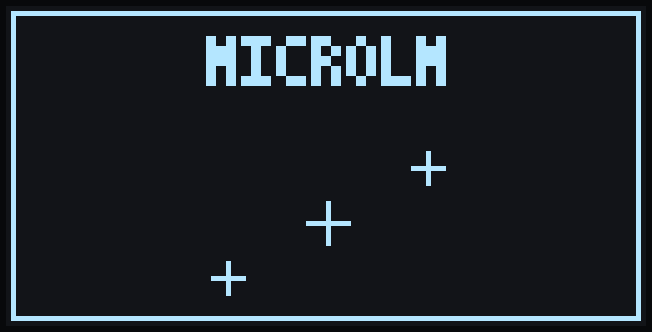</td>
<td align="center"></td>
<td align="center">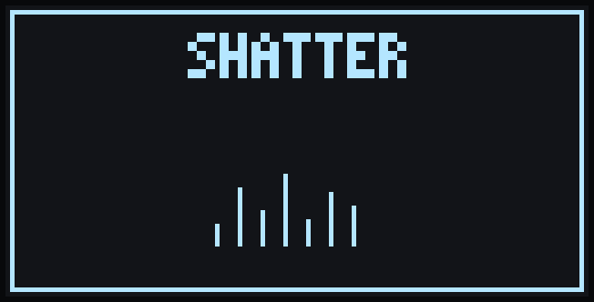</td>
<td align="center">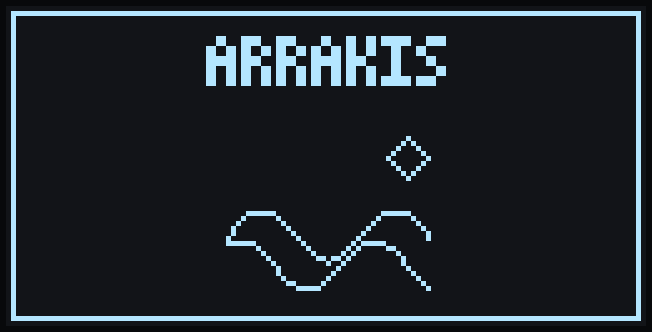</td>
</tr>
<tr>
<td align="center">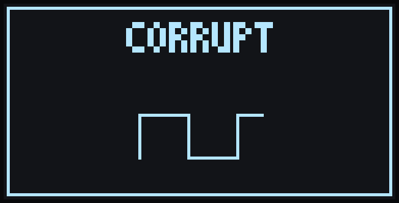</td>
<td align="center">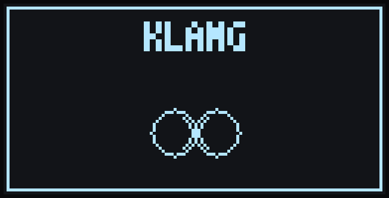</td>
<td align="center">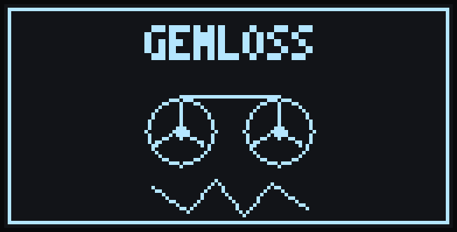</td>
<td align="center">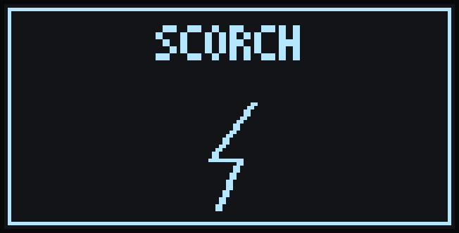</td>
</tr>
<tr>
<td align="center">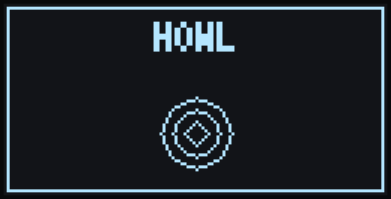</td>
<td align="center">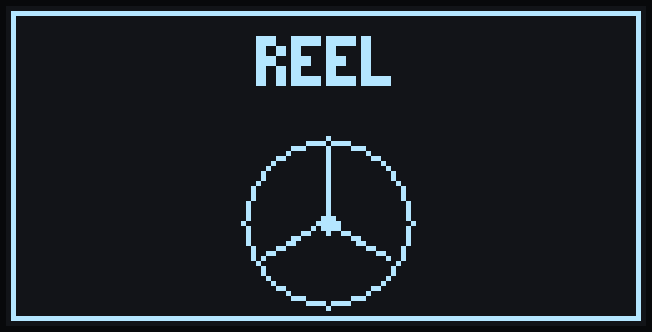</td>
<td align="center">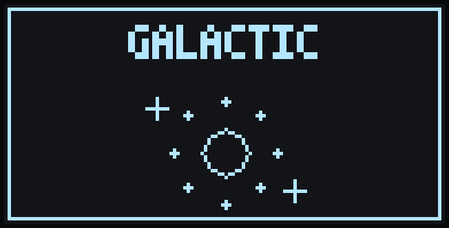</td>
<td align="center">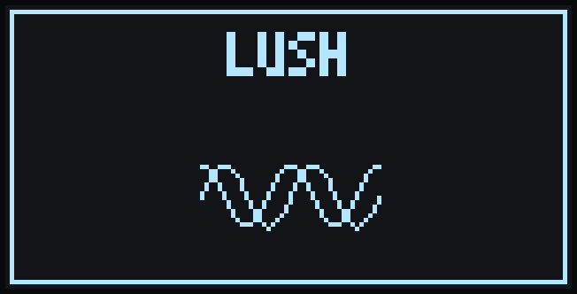</td>
</tr>
<tr>
<td align="center">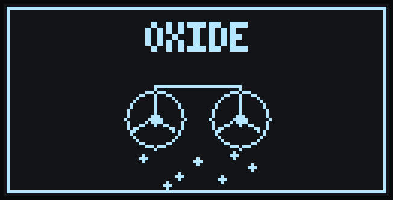</td>
<td align="center">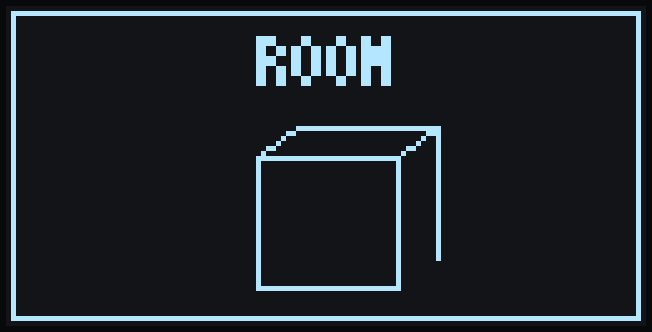</td>
<td align="center">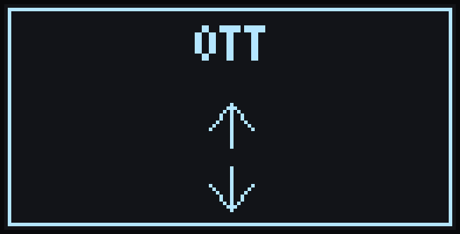</td>
<td align="center">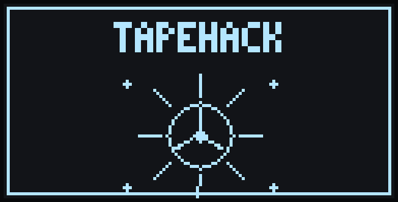</td>
</tr>
<tr>
<td align="center">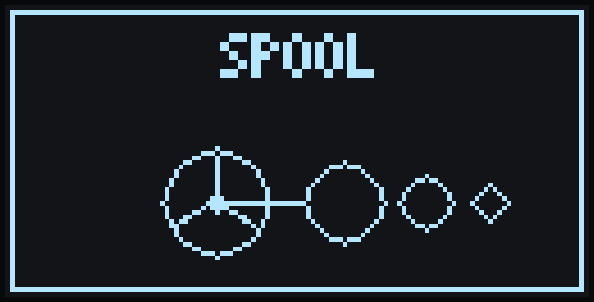</td>
</tr>
</table>

> Not all hardware-verified yet, and the pedal can't hold/run all 17 at once
> (storage + DSP limits) — install a curated subset, back up first, flash one
> at a time. See [CUSTOM_EFFECTS.md](CUSTOM_EFFECTS.md).

## Download Effects

The ready-to-load effects are in [dist/](dist/). Point Zoom Effect Manager at
that folder, or download individual `.ZDL` files from it. You do not need the
build toolchain unless you want to modify or rebuild effects.

## Install With Zoom Effect Manager

Use [Zoom Effect Manager](https://zoomeffectmanager.com/en/download/) 2.3.3 or
newer.

1. Open Zoom Effect Manager, connect your pedal, then open `Settings`.
2. Choose `Read Effects from folder` and select this repo's [dist/](dist/)
   folder.


3. In the effect browser, enable `Effects from devices` and `From Folder`.
4. Add the desired effects to the device and write them with Zoom Effect
   Manager.


Back up your current effect list before writing. This project is still reverse
engineering firmware behavior, and experimental builds can crash or freeze a
pedal until power-cycled.

More detailed install notes live in [docs/INSTALLING-ZDLS.md](docs/INSTALLING-ZDLS.md).

## Compatibility

Hardware testing is still narrow. Treat every model outside the confirmed row
as unverified until someone reports a clean load and audio test.

| Device family | Status |
|---|---|
| Zoom MS-70CDR firmware 2.10 | Primary hardware target; current release effects have been developed against this pedal. |
| Other ZDL-based Zoom MultiStomp pedals | Unconfirmed. They may load compatible ZDLs, but need hardware reports. |
| Newer Zoom ZD2-based pedals | Not supported by these ZDL builds. |

## Build Your Own Effects

Start from [src/airwindows/gain/](src/airwindows/gain/) if you want the
smallest working custom effect. Copy that directory, give the effect a new
name and unused `fxid` in `manifest.json`, then update the C audio function and
`build.py` to use the new names. Add the new build script to
[build_all.py](build_all.py) once it builds on its own.

Keep the first hardware test boring: `audio_nop: true` or tiny pass-through
DSP, no large static state, no heap, and no new runtime helper calls. The safe
path is documented in [docs/SAFE-DSP-RULES.md](docs/SAFE-DSP-RULES.md) and the
effect directory conventions are summarized in
[src/airwindows/README.md](src/airwindows/README.md).

## Known Issues

- Only the Zoom MS-70CDR firmware 2.10 has been tested seriously so far.
- Experimental builds can freeze or crash the pedal until it is power-cycled.
- `ToTape9.ZDL` now loads and runs on the test MS-70CDR after removing runtime
  `__c6xabi_divf` from the full DSP path. It is still under validation for
  parameter initialization, preset behavior, and source-equivalent exactness.
  The latest build treats zeroed parameter slots as unmaterialized defaults to
  address the reload mute report; this still needs hardware confirmation.
- `VerbTiny.ZDL` is a new Airwindows reverb port candidate. It builds cleanly
  with `ctx[3]` state and no object relocations, but it has not been
  hardware-tested yet.
- `Galactic.ZDL` is a larger Airwindows reverb candidate. It builds cleanly
  with about 528 KB of `ctx[3]` state and no object relocations, but it has not
  been hardware-tested yet.
- `TEcho4.ZDL` is a custom Airwindows-inspired tape echo, not a 1:1
  Airwindows port. It builds as a Delay-category effect with `ctx[3]` delay
  memory, a compact FIR derived from a UAD Galaxy Tape Echo IR, TapeHack-style
  saturation, adjustable wear filtering, measured wow/flutter, a compact mono
  spring fallback, and a BPM+division tempo workflow. Desktop listening has
  selected a closer Galaxy spring reference model: a 744 ms measured body plus
  an eight-line FDN tail. Porting that longer spring model into the bounded
  pedal runtime remains pending. Hardware result is pending; true host tap
  tempo for custom ZDLs is still unproven.
- ZDL filenames should have unique basenames of 8 characters or less. Zoom
  tooling/device code can truncate longer basenames, so collisions like
  `TapeEcho4.ZDL` -> `TapeEcho.ZDL` can create duplicate effect identities and
  freeze the pedal when loading. This repo now ships that effect as
  `TEcho4.ZDL`.
- `OTT.ZDL` is a custom Dynamics-category OTT-style multiband compressor, not
  an Ableton port. It exposes `DryWet`, `Time`, `Output`, and `SplitFrq`, and
  builds cleanly with small `ctx[3]` state, no `.fardata`, no `.text`, and no
  object relocations. Hardware result is pending.
- On MS-70CDR, Drive-category custom effects may not appear in the on-device FX
  browser unless at least one stock Drive effect is also installed. `ToTape9`
  is intentionally categorized as Drive, so install a stock Drive effect too if
  it flashes but does not show up when scrolling the pedal.
- Parameter scaling is part of the porting work. A port should not be called
  source-equivalent until its raw knob ranges have been confirmed on hardware.
- These are `.ZDL` builds, not `.ZD2` builds.

## Documentation

Start here if you want more than the download folder:

| Doc | What it covers |
|---|---|
| [docs/INSTALLING-ZDLS.md](docs/INSTALLING-ZDLS.md) | Step-by-step Zoom Effect Manager folder install. |
| [docs/ZDL-REVERSE-ENGINEERING-STATUS.md](docs/ZDL-REVERSE-ENGINEERING-STATUS.md) | Current map of the ZDL wrapper, runtime ABI, and known state fields. |
| [docs/STATE-ABI-PROGRESS.md](docs/STATE-ABI-PROGRESS.md) | Compact current map of hardware-proven state/edit-handler findings. |
| [docs/AIRWINDOWS-1TO1-PORT-ROADMAP.md](docs/AIRWINDOWS-1TO1-PORT-ROADMAP.md) | Roadmap for making honest source-equivalent Airwindows ports. |
| [docs/AIRWINDOWS-EXACT-PORTS.md](docs/AIRWINDOWS-EXACT-PORTS.md) | Rules for what can and cannot be called a 1:1 Airwindows port. |
| [docs/SAFE-DSP-RULES.md](docs/SAFE-DSP-RULES.md) | Pedal-safe DSP/linking constraints learned from hardware failures. |
| [docs/3-PARAM-LINKER-BUG.md](docs/3-PARAM-LINKER-BUG.md) | Investigation of the old edit-mode parameter-count bug. |
| [docs/TI-PDF-NOTES.md](docs/TI-PDF-NOTES.md) | Notes distilled from the TI C6000 manuals in this folder. |
| [docs/CONTRIBUTING.md](docs/CONTRIBUTING.md) | Hardware-test asks and contribution notes. |
| [docs/sprab89b.pdf](docs/sprab89b.pdf) | TI C6000 application note reference. |
| [docs/sprui03f.pdf](docs/sprui03f.pdf) | TI C6000 compiler/toolchain reference. |
| [docs/sprui04g.pdf](docs/sprui04g.pdf) | TI C6000 assembly/linker tools reference. |
| [build/ABI.md](build/ABI.md) | Low-level linker/runtime ABI reference for developers. |

## Build From Source

Desktop listening previews are available before flashing hardware. See
[tools/audio_preview/README.md](tools/audio_preview/README.md) for the
manifest-driven WAV renderer and current adapter coverage.

Building requires Python 3.10+ and TI C6000 Code Generation Tools. Installing
prebuilt effects from [dist/](dist/) does not.

The build scripts currently expect the TI compiler here:

```text
/Applications/ti/ccs2050/ccs/tools/compiler/ti-cgt-c6000_8.5.0.LTS
```

On Linux, Windows, or another Code Composer Studio install, update `TI_ROOT` in
the relevant `src/airwindows/*/build.py` or `src/custom/*/build.py`.

Build release effects:

```bash
python3 -B build_all.py
```

Build one effect:

```bash
python3 -B build_all.py stereochorus
python3 -B build_all.py tapeecho4
python3 -B build_all.py ott
python3 -B build_all.py totape9
python3 -B build_all.py verbtiny
```

Build diagnostic/probe effects too:

```bash
python3 -B build_all.py --all
```

The default build intentionally keeps [dist/](dist/) clean and release-focused.
Diagnostic ZDLs are useful for development, but are moved to `build/probes/`
and should not be mixed into the download folder.

## Technical Notes

This repo builds loadable Zoom `.ZDL` effects without Zoom's unreleased SDK.
The core pieces are:

| Path | Purpose |
|---|---|
| [build/linker.py](build/linker.py) | Static linker: TI C6000 `.obj` -> complete Zoom `.ZDL`. |
| [src/airwindows/](src/airwindows/) | Effect sources, manifests, images, and per-effect build scripts. |
| [src/custom/](src/custom/) | Original non-Airwindows effects built with the same linker/safety rules. |
| [src/hardware_probes/](src/hardware_probes/) | Diagnostic ZDLs used to map the pedal runtime ABI. |
| [dist/](dist/) | Release `.ZDL` files for users; never probes. |
| [stock_zdls/](stock_zdls/) | Tracked 830-file stock ZDL corpus used for comparison. |

The important recent finding is that custom effects can use the host-managed
large state descriptor at `ctx[3]`. That made the stateful `StereoChorus` port
possible, and the no-divide `ToTape9` full-kernel build now also loads and runs
on the test MS-70CDR. `VerbTiny` and `Galactic` are reverb candidates using the
same large-state strategy. `TEcho4` / `TapeEcho4` uses that same safe state pattern for a
custom tape-delay design, and `OTT` uses a small `ctx[3]` state block for
multiband envelope/gain history. The next ToTape9 work is parameter/default
lifecycle validation and source-equivalence testing.

Known runtime map for custom ZDLs:

| Field | Meaning |
|---:|---|
| `ctx[1]` | parameter float table |
| `ctx[4]` | dry/guitar input buffer |
| `ctx[5]` | current effect buffer, 8 left samples then 8 right samples |
| `ctx[6]` | output accumulator for effects that add instead of processing in place |
| `ctx[11]` / `ctx[12]` | magic shuttle; preserve every audio call |
| `ctx[2] + 0x10` / `ctx[2] + 0x18` | small persistent per-instance state blocks |
| `ctx[3][0..2]` | large per-instance descriptor: base, end, byte span |

Parameter scaling is not universal across every handler path. `StereoChorus`
showed that the current release handler path behaves like normalized `0..1`
knob floats, while older helper assumptions saturated around UI value 14.
Effects that claim source-compatible control laws should document how their raw
parameter scaling was confirmed.

## Repository Layout

```text
ZoomMultistompZDL/
├── README.md
├── build/                 linker, ELF/ZDL helpers, stock-derived handler blobs
├── docs/                  install notes, ABI status, and porting guidance
├── dist/                  release ZDLs to load in Zoom Effect Manager
├── src/hardware_probes/       diagnostic ZDLs for runtime ABI experiments
├── src/airwindows/        effect sources, manifests, and build scripts
├── src/custom/            original non-Airwindows effects
├── stock_zdls/            tracked 830-file stock ZDL corpus used for comparison
└── build_all.py           release/probe build entrypoint
```

Several research references are useful locally but are intentionally ignored by
git, so they are not part of this repo checkout:

```text
airwindows-ref/          optional full Airwindows source tree
zoom-fx-modding-ref/     optional community ZDL notes and disassembly walkthroughs
ZoomPedalFun-main/       optional independent Zoom firmware RE work
```

If you clone those beside the repo, keep treating them as read-only references.

## Contributing

Hardware reports are gold. When testing a ZDL, please include:

| Item | Example |
|---|---|
| Pedal model and firmware | `MS-70CDR firmware 2.10` |
| ZDL filename and commit | `StChorus.ZDL @ cee0d8a` |
| Load result | boots, freezes on startup, freezes on unbypass |
| Audio result | bypass, dry passthrough, chorus works, high-pitched tone |
| Parameter behavior | Speed works 0..100, Depth saturates, page 2 knob missing |

Open an issue or PR with findings. Keep experimental claims precise: "boots on
my MS-70CDR" is more useful than "works everywhere."

## License

Repository code is MIT unless a file says otherwise. Airwindows plugin DSP is
MIT by Chris Johnson/Airwindows. Zoom firmware, stock effects, and third-party
reference material are owned by their respective authors and are used only for
interoperability and reverse-engineering research.
