# Zoom MultiStomp ZDL

Custom `.ZDL` effects for Zoom MultiStomp pedals, plus the reverse-engineered
toolchain used to build them — no Zoom SDK required.

## Custom effect pack

This fork ships a curated **library of 14 effects** — all grouped under the
Delay category, each with a custom on-device cover. Eleven originals
(granular shimmer, drum glitch, tape degradation, a Dune-style drone, a Data
Corrupter-style synth, a swept ring mod, high-gain amp+cab, a feedback howl,
a Tensor-style tape warp, a Parting-style glitch delay) plus three
Airwindows-derived ports (Galactic reverb, Oxide tape, Spool tape echo).
See [CUSTOM_EFFECTS.md](CUSTOM_EFFECTS.md) for knob layouts and sound demos.

<table>
<tr>
<td align="center">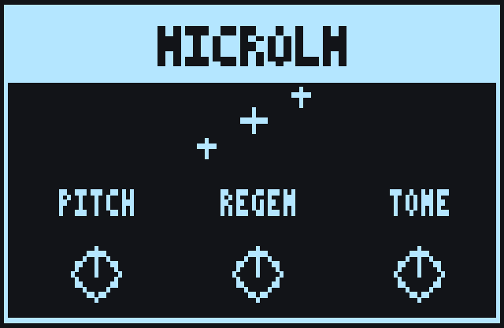</td>
<td align="center">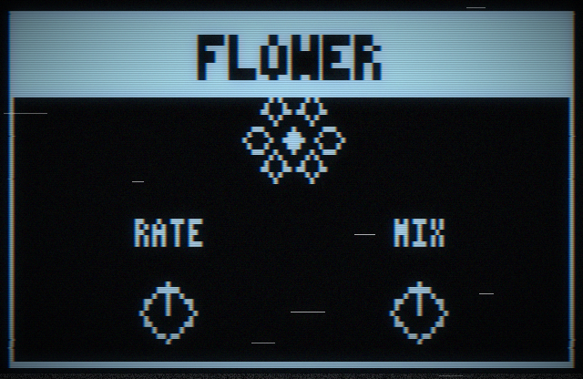</td>
<td align="center">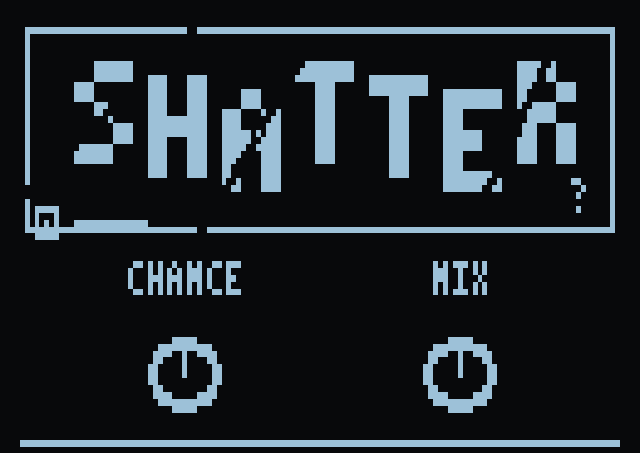</td>
<td align="center">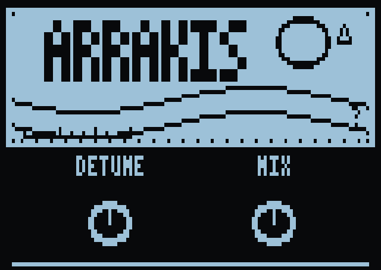</td>
</tr>
<tr>
<td align="center">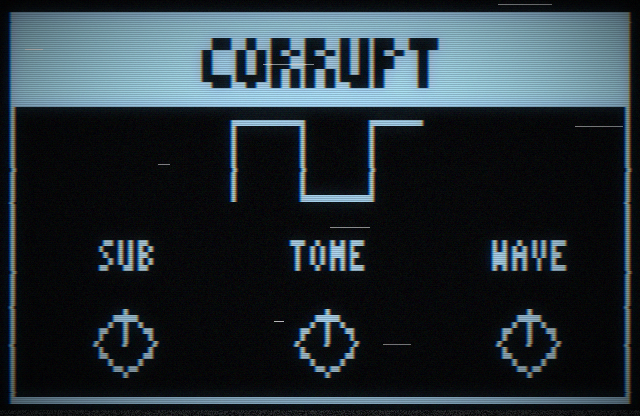</td>
<td align="center">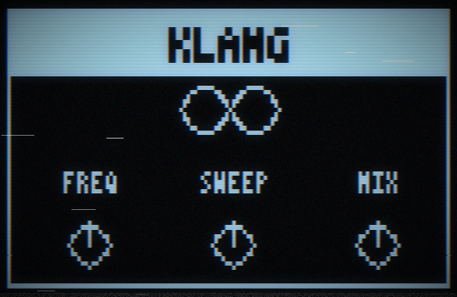</td>
<td align="center">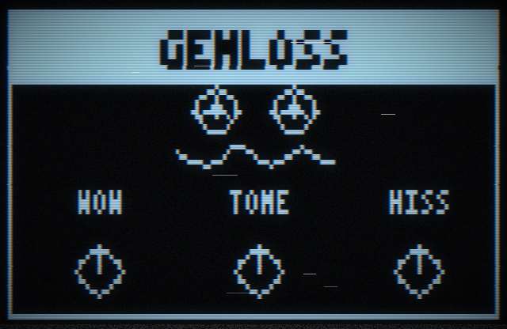</td>
<td align="center">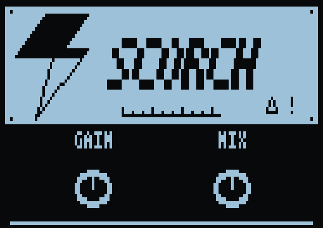</td>
</tr>
<tr>
<td align="center">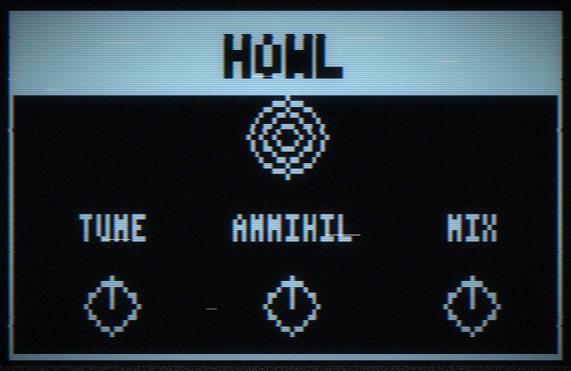</td>
<td align="center">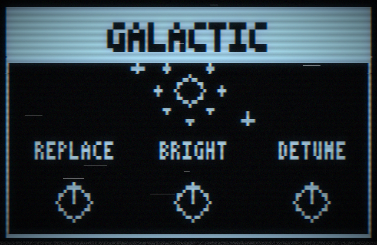</td>
<td align="center">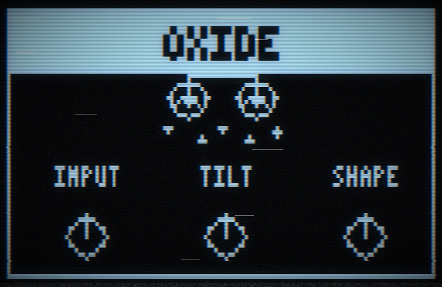</td>
<td align="center">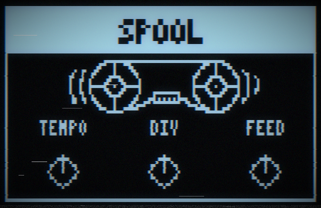</td>
</tr>
<tr>
<td align="center">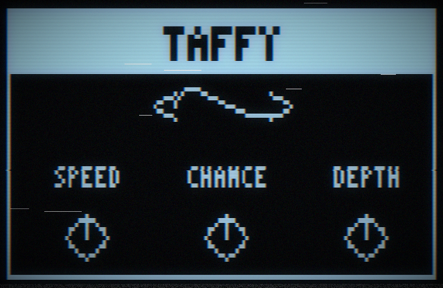</td>
<td align="center">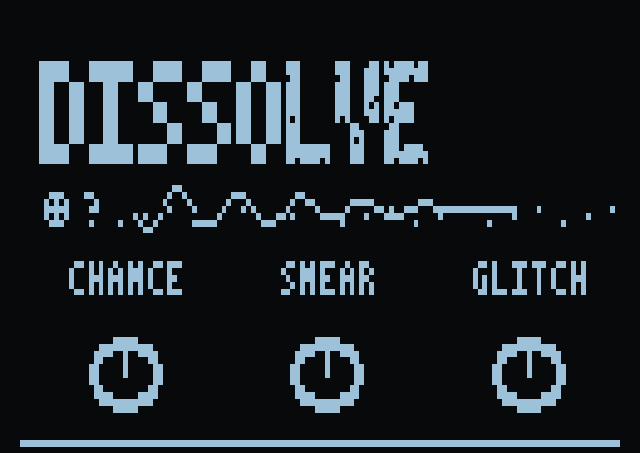</td>
</tr>
</table>

> Not all hardware-verified yet, and the pedal can't hold/run all 14 at once
> (storage + DSP limits) — install a subset, back up first, flash one at a
> time. All volume knobs default to **1** so nothing is loud at patch select.

## Download Effects

The ready-to-load effects are in [dist/](dist/). Point Zoom Effect Manager at
that folder, or download individual `.ZDL` files from it. You do not need the
build toolchain unless you want to modify or rebuild effects.

## Install With Zoom Effect Manager

Use [Zoom Effect Manager](https://zoomeffectmanager.com/en/download/) 2.3.3 or
newer.

1. Open Zoom Effect Manager, connect your pedal, then open `Settings`.
2. Choose `Read Effects from folder` and select this repo's [dist/](dist/)
   folder.


3. In the effect browser, enable `Effects from devices` and `From Folder`.
4. Add the desired effects to the device and write them with Zoom Effect
   Manager.


Back up your current effect list before writing. Experimental builds can
freeze a pedal until power-cycled.

**Gotchas learned the hard way:**

- Effect Manager does **not replace** an installed effect with the same fxid —
  remove the old one from the device, re-read the folder, then add the new one.
- Effect Manager's browser **thumbnails** come from the app's internal stock
  database; custom effects always show its generic pedal icon. The covers in
  this repo control the **pedal's screen**, which is what matters live.
- `FS.bin size mismatch` when writing = too many effects installed (storage
  overflow). `DSP full` = the per-patch processing budget is blown — run heavy
  effects (Microloom, Galactic, Spool) one per patch.
- **If the pedal freezes on the boot screen** (a patch references a bad
  effect): power off, hold the **Parameter 1 (leftmost) knob pressed in**,
  power on → `All INITIALIZE` → press the footswitch. Patches reset to
  factory, but effect binaries stay installed — then remove the bad one.

More detailed install notes live in [docs/INSTALLING-ZDLS.md](docs/INSTALLING-ZDLS.md).

## Compatibility

| Device family | Status |
|---|---|
| Zoom MS-70CDR firmware 2.10 | Primary hardware target; the release effects are developed and play-tested against this pedal. |
| Other ZDL-based Zoom MultiStomp pedals (MS-50G, MS-60B, G1on/G1Xon, B1on/B1Xon) | Should load compatible ZDLs, but unconfirmed — hardware reports welcome. |
| Newer Zoom ZD2-based pedals | Not supported by these ZDL builds. |

## What We Learned (field notes)

Hard-won findings from getting these effects stable on real hardware. The
deep versions live in [docs/](docs/) and [build/ABI.md](build/ABI.md).

### The two confirmed freeze classes

1. **Code→data relocations.** Any `static` array referenced from the audio
   function (even `static const float[]`) forces a relocation and freezes the
   pedal at load. Bake tables as `#define` scalar literals or unrolled
   macro sums instead — they compile to immediates. A clean build prints
   `.fardata: 0 bytes` and `Applied 0 .obj relocations`; anything else is a
   red flag. (This froze Spool until its 64-tap FIR was unrolled.)
2. **Unresolved runtime helpers.** Any float division, integer `/` or `%`,
   or math-lib call (`sinf`, `powf`, …) emits a `__c6xabi_*` helper the
   loader can't resolve — the branch goes to address 0. Use polynomial
   sin/cos, Newton-iteration reciprocals, and bit-mask tricks instead of
   modulo. See [docs/SAFE-DSP-RULES.md](docs/SAFE-DSP-RULES.md).

### Memory and CPU budgets

- The host gives each effect instance a large state arena via `ctx[3]`,
  hardware-probed to **≥705,536 bytes** — Lush-class (512 KB) and Spool-class
  (545 KB) states load fine. Always bounds-check the descriptor and clear big
  buffers lazily in chunks.
- The linker currently advertises a hardcoded CPU cost (20.0) while stock
  effects declare 11.6–128, so the firmware can green-light patches the DSP
  can't actually run. Symptoms range from `DSP full` to a hang at patch load.
  Treat very heavy reverbs with respect until per-effect honest costs land.

### Parameters are hostile

- The proven knob path delivers **normalized 0..1 floats** (an earlier ×7.14
  scaling assumption made every knob saturate at ~14% travel).
- At **patch load**, stored values are *not* materialized — params read 0
  until the knob is wiggled. Defaults are therefore what you hear first:
  every volume-type knob in this pack defaults to **1** (quiet).
- **Refocusing an effect in the chain UI clobbers its param block with
  garbage** until wiggled. The fix (piloted in Howl v3) is an edit-driven
  knob latch: a real knob turn changes one slot at a time, so bulk rewrites
  are detected and ignored, and the effect keeps sounding as dialed.
- Up to 9 params work (3 pages × 3), image shows the first three knobs;
  the multi-knob synthesized-handler path is hardware-proven.

### Feedback DSP on this box

- Never feed a resonant filter back into itself — loop gain crosses unity
  almost everywhere. Use a pole-radius-controlled resonator (radius < 1 is
  unconditionally stable); that's how Howl works.
- A cubic soft-clip has **1.5× gain at small signal** — inside a feedback
  loop that multiplies loop gain and self-oscillates. Use a unity-slope
  clipper (`x − x³/6.75`) in loops. (Caught twice: Scorch's output, then
  Dissolve's smear loop.)

### Covers, screens, thumbnails

- The on-device cover is the **full 128×64**, 1-bpp, column-major in eight
  8-row blocks, run-length encoded. The firmware paints live 20×15 knob-value
  boxes on top at coordinates the ZDL declares — so draw labeled dials under
  them, stock-style ([build/decode_picture.py](build/decode_picture.py)
  decodes any ZDL's cover; ~130 stock covers were decoded to learn this).
- The LCD pixels are ~1.3× taller than wide: pre-compress artwork vertically
  or circles render as tall ellipses.
- Hand-drawn covers: [tools/cover_editor.html](tools/cover_editor.html) is a
  self-contained pixel editor with a device-aspect preview; exported JSON in
  `src/airwindows/common/covers/` overrides the generated cover at build time.

### Identity and packaging

- ZDL basenames must be **≤ 8 characters** and unique after truncation, or
  effect identities collide and the pedal freezes.
- There is **no sort field** in the header — on-device browse order tracks
  fxid. This pack uses 450+ to avoid stock collisions.
- gid ↔ category must match the exported symbol prefix
  (1=DYN, 2=FLT, 3=DRV, 6=CHO/MOD, 8=DLY, 9=REV); everything here is gid 8
  (`Fx_DLY_*`) so the pack lives together in the least crowded menu.

## Build Your Own Effects

Start from a small effect in [src/custom/](src/custom/) (e.g. `reel` or
`klang`). Copy the directory, give the effect a new name and an unused `fxid`
in `manifest_pedal.json`, update the C audio function and `build.py`, then add
it to [build_all.py](build_all.py).

Keep the first hardware test boring: `audio_nop: true` or tiny pass-through
DSP, no static arrays, no divides, magic shuttle preserved. The safe path is
[docs/SAFE-DSP-RULES.md](docs/SAFE-DSP-RULES.md); effect directory conventions
are in [src/airwindows/README.md](src/airwindows/README.md).

## Build From Source

Building requires Python 3.10+ and the TI C6000 Code Generation Tools
(v8.5.0). Installing prebuilt effects from [dist/](dist/) does not.

The build scripts expect the TI compiler here (edit `TI_ROOT` in the
per-effect `build.py` if yours differs):

```text
/Applications/ti/ti-cgt-c6000_8.5.0.LTS
```

```bash
python3 -B build_all.py            # all 14 release effects -> dist/
python3 -B build_all.py taffy      # one effect
python3 -B build_all.py --all      # + diagnostic/probe builds (-> build/probes/)
```

Desktop listening previews for the originals (no compiler, no pedal) are in
[tools/audio_preview/README.md](tools/audio_preview/README.md).

## Technical Notes

This repo builds loadable Zoom `.ZDL` effects without Zoom's unreleased SDK:

| Path | Purpose |
|---|---|
| [build/linker.py](build/linker.py) | Static linker: TI C6000 `.obj` → complete Zoom `.ZDL` (header, descriptor table, image info, edit handlers). |
| [build/decode_picture.py](build/decode_picture.py) | Decode any ZDL's on-device cover + knob-box layout back to pixels/PNG. |
| [tools/cover_editor.html](tools/cover_editor.html) | Browser pixel editor for covers, with device-aspect preview. |
| [src/custom/](src/custom/) | Original effects. |
| [src/airwindows/](src/airwindows/) | Airwindows-derived ports. |
| [src/hardware_probes/](src/hardware_probes/) | Diagnostic ZDLs used to map the pedal runtime ABI. |
| [dist/](dist/) | Release `.ZDL` files; never probes. |
| [stock_zdls/](stock_zdls/) | Tracked stock ZDL corpus used for comparison and layout ground truth. |

Known runtime map for custom ZDLs:

| Field | Meaning |
|---:|---|
| `ctx[1]` | parameter float table |
| `ctx[4]` | dry/guitar input buffer |
| `ctx[5]` | current effect buffer, 8 left samples then 8 right samples |
| `ctx[6]` | output accumulator for effects that add instead of processing in place |
| `ctx[11]` / `ctx[12]` | magic shuttle; preserve every audio call |
| `ctx[2] + 0x10` / `ctx[2] + 0x18` | small persistent per-instance state blocks |
| `ctx[3][0..2]` | large per-instance descriptor: base, end, byte span (≥705,536 B) |

## Repository Layout

```text
ZoomMultistompZDL/
├── README.md
├── build/                 linker, ELF/ZDL helpers, cover decoder, handler blobs
├── docs/                  install notes, ABI status, and porting guidance
├── dist/                  release ZDLs to load in Zoom Effect Manager
├── graphics/              gallery renders of the on-device covers
├── tools/                 cover editor + desktop audio preview
├── src/custom/            original effects
├── src/airwindows/        Airwindows-derived ports + shared helpers
├── src/hardware_probes/   diagnostic ZDLs for runtime ABI experiments
├── stock_zdls/            tracked stock ZDL corpus used for comparison
└── build_all.py           release/probe build entrypoint
```

Several research references are useful locally but intentionally git-ignored:
`airwindows-ref/`, `zoom-fx-modding-ref/`, `ZoomPedalFun-main/`. If you clone
them beside the repo, treat them as read-only references.

## Documentation

| Doc | What it covers |
|---|---|
| [docs/INSTALLING-ZDLS.md](docs/INSTALLING-ZDLS.md) | Step-by-step Zoom Effect Manager folder install. |
| [docs/SAFE-DSP-RULES.md](docs/SAFE-DSP-RULES.md) | Pedal-safe DSP/linking constraints learned from hardware failures. |
| [docs/ZDL-REVERSE-ENGINEERING-STATUS.md](docs/ZDL-REVERSE-ENGINEERING-STATUS.md) | Current map of the ZDL wrapper, runtime ABI, and known state fields. |
| [docs/STATE-ABI-PROGRESS.md](docs/STATE-ABI-PROGRESS.md) | Hardware-proven state/edit-handler findings. |
| [docs/AIRWINDOWS-EXACT-PORTS.md](docs/AIRWINDOWS-EXACT-PORTS.md) | Rules for what can and cannot be called a 1:1 Airwindows port. |
| [docs/CONTRIBUTING.md](docs/CONTRIBUTING.md) | Hardware-test asks and contribution notes. |
| [build/ABI.md](build/ABI.md) | Low-level linker/runtime ABI reference for developers. |
| [docs/TI-PDF-NOTES.md](docs/TI-PDF-NOTES.md) + TI PDFs | TI C6000 toolchain references. |

## Contributing

Hardware reports are gold. When testing a ZDL, please include:

| Item | Example |
|---|---|
| Pedal model and firmware | `MS-70CDR firmware 2.10` |
| ZDL filename and commit | `Taffy.ZDL @ 864d85d` |
| Load result | boots, freezes on startup, freezes on unbypass |
| Audio result | bypass, dry passthrough, effect works, high-pitched tone |
| Parameter behavior | Speed works 0..100, Chance saturates, page 2 knob missing |

Open an issue or PR with findings. Keep experimental claims precise: "boots on
my MS-70CDR" is more useful than "works everywhere."

## License

Repository code is MIT unless a file says otherwise. Airwindows plugin DSP is
MIT by Chris Johnson/Airwindows. Zoom firmware, stock effects, and third-party
reference material are owned by their respective authors and are used only for
interoperability and reverse-engineering research.
