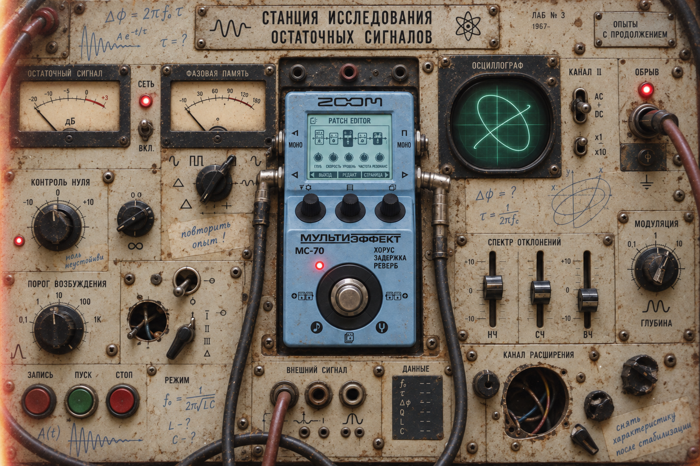
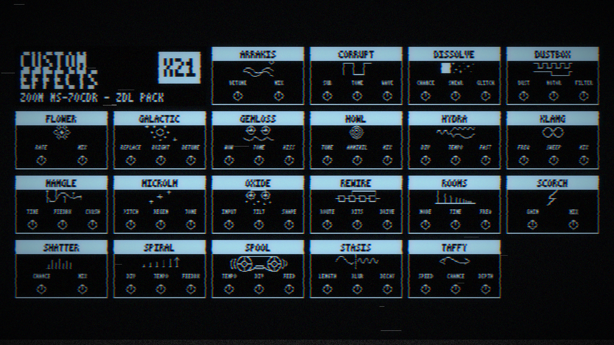
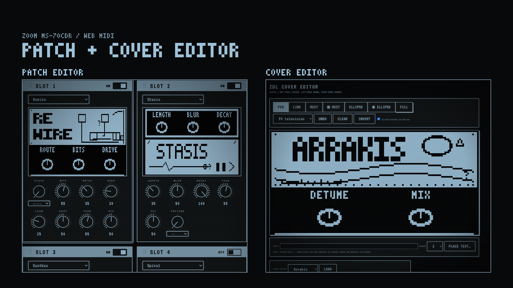
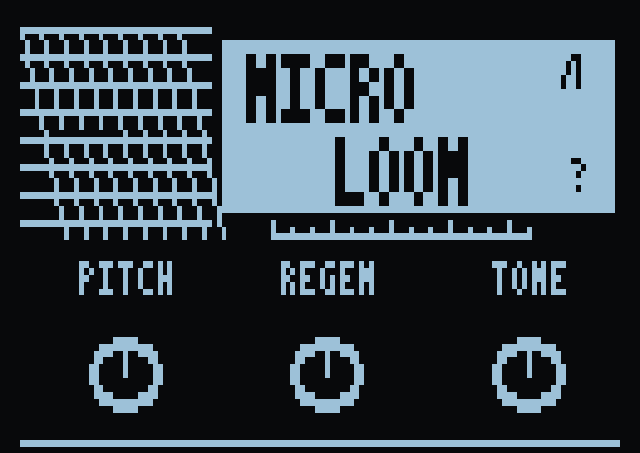
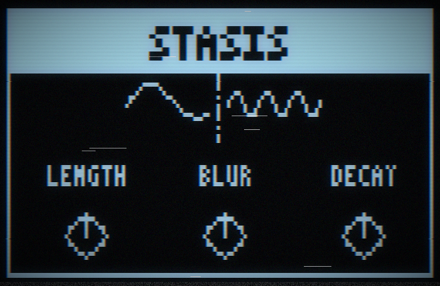
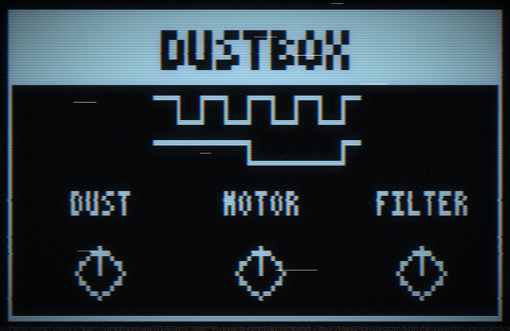
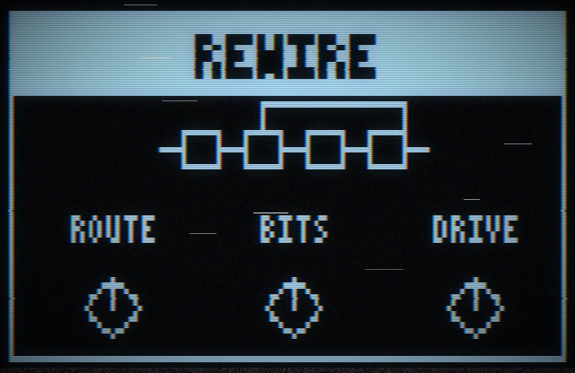
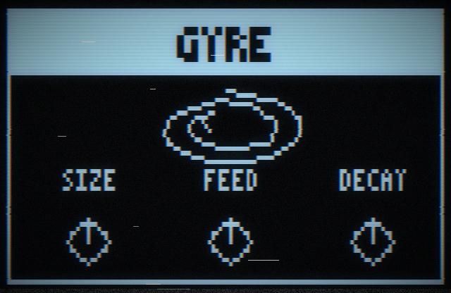

# Zoom MultiStomp ZDL

<p align="center"></p>

Custom `.ZDL` effects for Zoom MultiStomp pedals, plus the reverse-engineered
toolchain used to build them — no Zoom SDK required.

This was a good amount of work and tokens, please consider to: [buymeacoffee.com/sz0kfixkct](https://buymeacoffee.com/sz0kfixkct)

<p align="center"></p>

**New here?** This is a pack of 22 extra effects plus a free browser-based
[Patch Editor](https://themanro.github.io/ZoomMultistompZDL/tools/patch_editor.html)
for adjusting knobs and arranging effects in your patches. On the original
MS-70CDR, you install the ready-made files from [dist/](dist/) over USB using
Zoom Effect Manager—no custom firmware reflash, coding, or compiling needed.
Back up your patches and effect list first. The Patch Editor edits patches;
Zoom Effect Manager installs the effects. See the [installation guide](docs/INSTALLING-ZDLS.md).

**Pedal compatibility:**

* **Tested:** original **MS-70CDR (firmware 2.10)**—custom effects and Patch Editor.
* **Potential effect compatibility, not yet verified for this pack:** **MS-50G,
  MS-60B, G1on, G1Xon, B1on and B1Xon**. PE currently enables editing only on the
  original MS-70CDR; these are not confirmed PE targets.
* **Not supported:** **MS-100BT** and **Plus models**, including **MS-50G+,
  MS-60B+ and MS-70CDR+**. See [Compatibility](#compatibility) below.

## Quickstart — edit your pedal from the browser

**[▶ Open the Patch Editor](https://themanro.github.io/ZoomMultistompZDL/tools/patch_editor.html)**

Plug the MS-70CDR in over USB, click **Connect**, and edit patches live — no
install, no clone, nothing sent anywhere (it is one self-contained HTML file and
your patch library lives in your own browser).

* **Opera or Edge.** Safari and Firefox do not implement Web MIDI; the editor
  will tell you if you are on one of them. **Chrome 152 is currently broken** —
  a Web MIDI *input* regression means output works, no dump ever arrives, and no
  error is raised. `tools/midi_check.html` confirms it in isolation.
* **Close Zoom Effect Manager first** — it holds the MIDI port. "The pedal did
  not respond" is usually this.
* Slots 1–3 respond to knob moves instantly. Slots 4–6 cannot be edited live by
  this hardware, so the editor applies those for you — see
  [docs/MIDI-PARAM-EDIT.md](docs/MIDI-PARAM-EDIT.md). Effects built before
  2026-09-10 also load with their knobs inert until nudged; **rebuild or
  reinstall from [dist/](dist/)** and that goes away.

<p align="center"></p>

**[▶ Open the Cover Editor](https://themanro.github.io/ZoomMultistompZDL/tools/cover_editor.html)**
— draw the 128×64 image an effect shows on the pedal's screen. Drawing, PNG/JSON
export and the device preview all work from the link above; the one-click
**Update ZDL** button additionally needs the local build server:

```bash
git clone https://github.com/themanro/ZoomMultistompZDL.git
cd ZoomMultistompZDL
python3 tools/serve_editor.py        # opens the editor, wires up "Update ZDL"
```

Loading new effects onto the pedal still goes through Zoom Effect Manager — the
browser can edit patches, but it cannot install effects.

## Custom effect pack

**September 14 display update:** all 22 effects now have individual laboratory-inspired
graphics, corrected LCD proportions, and shorter pedal labels. Mode controls show
names in PE and supported custom effects show short names on the pedal. Reinstall
the updated files from [dist/](dist/) to get the pedal artwork and labels; refresh
the Patch Editor for its UI changes. Existing patch values and effect IDs are preserved.
See the [display update notes](docs/EFFECT-DISPLAY-REFRESH.md) for details.

This fork ships a curated **library of 22 effects** — all grouped under the
Delay category, each with a custom on-device cover. Eighteen originals, three
Airwindows-derived ports (Galactic reverb, Oxide tape, Spool tape echo), and one
contributed effect (Dustbox).
Full knob layouts, caveats and sound demos are in
[CUSTOM_EFFECTS.md](CUSTOM_EFFECTS.md).

<table>
<tr>
<td align="center"></td>
<td align="center"></td>
<td align="center"></td>
<td align="center"></td>
</tr>
<tr>
<td align="center"></td>
<td align="center"></td>
<td align="center"></td>
<td align="center"></td>
</tr>
<tr>
<td align="center"></td>
<td align="center"></td>
<td align="center"></td>
<td align="center"></td>
</tr>
<tr>
<td align="center"></td>
<td align="center"></td>
<td align="center"></td>
<td align="center"></td>
</tr>
<tr>
<td align="center"></td>
<td align="center"></td>
<td align="center"></td>
<td align="center"></td>
</tr>
<tr>
<td align="center"></td>
<td align="center"></td>
<td></td>
<td></td>
</tr>
</table>

### What each one does

Knob lists are read from the shipped `dist/` binaries, so they match what the
pedal actually shows.

| Effect | Knobs | What it is |
|---|---|---|
| **Microlm** | Pitch, Regen, Tone, Mix | granular pitch-shimmer cloud; grains are pitched and fed back, so it builds rather than repeats |
| **Flower** | Rate, Mix | Korg-style random sample-and-hold step filter — the "Digital Bath" sound |
| **Shatter** | Chance, Mix | stutter / beat-repeat glitch for drums |
| **Arrakis** | Detune, Mix | Dune-style detuned sub-octave drone, two subs beating against each other |
| **Corrupt** | Sub, Tone, Wave, Mix | EQD Data Corrupter-style PLL square synth with tracked sub and divided harmony |
| **Klang** | Freq, Sweep, Mix | swept-carrier ring modulator — sirens, dive bombs, clangorous metal |
| **GenLoss** | Wow, Tone, Hiss, Mix | tape/VHS generation loss: wow, head-bump tone shift, hiss |
| **Scorch** | Gain, Mix | aggressive high-gain amp with a cab-style filter (cab baked as biquads, not an FIR) |
| **Howl** | Tune, Annihil, Mix | DBA Total Sonic Annihilation-style feedback loop that self-oscillates on demand |
| **Taffy** | Speed, Chance, Depth, Glide, Mix | Red Panda Tensor-style tape warp — reverse, stop, double-speed, random slips |
| **Dissolve** | Chance, Smear, Glitch, Mix | OBNE Parting-style glitch delay dissolving into a reverb wash |
| **Mangle** | Time, Feedbk, Crush, Tremolo, Pitch, Mix | delay with three blendable per-repeat mutations; all three at 0 is a clean delay |
| **Rooms** | Mode, Time, Freq, Depth, Mix | DBA Rooms-inspired multi-mode reverb: ROOM / DIGIT / PEAK / GATE / WAVE / GONG. Freq and Depth are re-purposed per mode |
| **Hydra** | Div, Tempo, Fast, Slow, Tone, Mix | **tempo-locked** double-time and half-time ghost layers on one delay ring; built for drums |
| **Spiral** | Div, Tempo, Feedbk, Rise, Glide, Span, Tone, Mix | **tempo-locked** delay whose repeats climb or sink in pitch, compounding every repeat |
| **Stasis** | Length, Blur, Decay, Tone, Mix, Capture | footswitch-triggered freeze — the note you just played is held while you play over it. Capture selects stomp or explicit capture |
| **Dustbox** | Dust, Motor, Filter, Power | DOD FX33 Buzz Box-style fuzz with a flip-flop sub-octave — contributed, MIT |
| **Rewire** | Route, Bits, Drive, Ring, Comb, Shift, Tone, Mix | five lo-fi blocks — crush, drive, ring mod, comb, frequency shift — in a chain you can **reorder**. Shift is a true single-sideband shifter (−51 dB image), so it moves partials off the harmonic series |
| **Gyre** | Size, Feed, Decay, Rise, Glide, Span, Tone, Mix | granular feedback loop; two grains half a window apart with complementary windows, so the loop is unity-throughput and holds instead of running away |
| **Galactic** | Replace, Bright, Detune, Bigness, Mix | lush Airwindows reverb, wet path boosted for pedal levels |
| **Oxide** | Input, Tilt, Shape, Flutter, FlutSpd, Bias, HeadBmp, Output, Mix | Airwindows ToTape9 saturation. Input is a 0–4× drive compensated above unity, Tilt the Dolby-style encode/decode balance, Bias an asymmetric even-harmonic drive |
| **Spool** | Tempo, Div, Feed, Flutter, Wow, Wear, Drive, Spring, Mix | tempo-locked tape echo with flutter, wow, head wear, drive and a spring tail. Feed reaches self-oscillation above ~90 |

> Every effect ends with a **Mix** knob (dry/wet, default 50), so levels and
> controls are consistent across the pack — an effect is audible as soon as it is
> selected. Dustbox is the exception; its fourth knob is Power.
>
> The pedal can't hold or run all 22 at once (storage + DSP limits) — install a
> subset, back up first, and flash one at a time. Run heavy effects (Microlm,
> Galactic, Spool) one per patch.

## Download Effects

The ready-to-load effects are in [dist/](dist/). Point Zoom Effect Manager at
that folder, or download individual `.ZDL` files from it. You do not need the
build toolchain unless you want to modify or rebuild effects.

## Install With Zoom Effect Manager

Use [Zoom Effect Manager](https://zoomeffectmanager.com/en/download/) 2.3.3 or
newer.

1. Open Zoom Effect Manager, connect your pedal, then open `Settings`.
2. Choose `Read Effects from folder` and select this repo's [dist/](dist/)
   folder.


3. In the effect browser, enable `Effects from devices` and `From Folder`.
4. Add the desired effects to the device and write them with Zoom Effect
   Manager.


Back up your current effect list before writing. Experimental builds can
freeze a pedal until power-cycled.

**Effects must be installed with Zoom Effect Manager first.** The patch editor
only *references* effects by id — it cannot install them. Its dropdown is the
full catalogue from every MS/G1/B1 model, not the subset on your pedal, so
selecting something Effect Manager has never written leaves that slot blank. The
editor warns when you pick an effect it has not seen in any of your patches, and
tells you if the pedal drops one after a write.

**If the effect browser says "No data to display, check filters":** step 3 is
not optional -- choosing the folder only tells Effect Manager where to look, and
the browser's `From Folder` source has to be ticked separately. Connect the
pedal before launching, and check no category filter is set (everything here is
in **Delay**). If it still shows nothing, verify the files really are ZDLs and
not saved HTML pages -- see
[docs/INSTALLING-ZDLS.md](docs/INSTALLING-ZDLS.md#check-that-your-download-is-real-windows-especially).

**Gotchas learned the hard way:**

- Effect Manager does **not replace** an installed effect with the same fxid —
  remove the old one from the device, re-read the folder, then add the new one.
- Effect Manager's browser **thumbnails** come from the app's internal stock
  database; custom effects always show its generic pedal icon. The covers in
  this repo control the **pedal's screen**, which is what matters live.
- `FS.bin size mismatch` when writing = too many effects installed (storage
  overflow). `DSP full` = the per-patch processing budget is blown — run heavy
  effects (Microloom, Galactic, Spool) one per patch.
- **If the pedal freezes on the boot screen** (a patch references a bad
  effect): power off, hold the **Parameter 1 (leftmost) knob pressed in**,
  power on → `All INITIALIZE` → press the footswitch. Patches reset to
  factory, but effect binaries stay installed — then remove the bad one.

More detailed install notes live in [docs/INSTALLING-ZDLS.md](docs/INSTALLING-ZDLS.md).

## Compatibility

| Device family | Status |
|---|---|
| Zoom MS-70CDR firmware 2.10 | Primary hardware target; the release effects are developed and play-tested against this pedal. |
| Other ZDL-based Zoom MultiStomp pedals (MS-50G, MS-60B, G1on/G1Xon, B1on/B1Xon) | Should load compatible ZDLs, but unconfirmed — hardware reports welcome. |
| Newer Zoom ZD2-based pedals | Not supported by these ZDL builds. |

**The "+" models (MS-50G+, MS-60B+, MS-70CDR+) use ZD2, not ZDL**, so nothing
here loads on them. Whether they could ever be targeted turns on one question:
is the payload analysable, or is it signed/encrypted? The evidence so far is
encouraging — `docs/STATE-ABI-PROGRESS.md` records a hand-decoded ZD2
`Fx_SFX_LineSel`, which means somebody read ZD2 machine code and understood it.

**Step-by-step guide: [docs/PROBING-A-NEW-PEDAL.md](docs/PROBING-A-NEW-PEDAL.md).**
Two things anyone with a "+" pedal can check, neither of which risks the
hardware:

* `python3 build/inspect_zd2.py Effect.ZD2` — reports entropy and structure.
  Uneven per-block entropy means plain code; flat and high everywhere means
  encrypted or compressed. Validated against a known-plain ZDL, random bytes and
  a gzip stream.
* Open the patch editor and click Connect. It reads the identity reply, adopts
  the device id so dumps are addressed correctly, and switches to READ-ONLY on
  any model but the MS-70CDR — every byte offset here was mapped against that
  one pedal, so writing elsewhere would scramble patches. If a "+" pedal answers
  `Reload bank` with a patch dump, that alone is worth reporting.

Worth being clear about why the MS-70CDR is hackable at all: Zoom themselves
ship a tool that writes effect binaries to it. None of this is an exploit. The
question for the "+" models is whether an official write path still exists, not
whether the format can be understood.

## What We Learned (field notes)

Hard-won findings from getting these effects stable on real hardware. The
deep versions live in [docs/](docs/) and [build/ABI.md](build/ABI.md).

### The two confirmed freeze classes

1. **Code→data relocations.** Any `static` array referenced from the audio
   function (even `static const float[]`) forces a relocation and freezes the
   pedal at load. Bake tables as `#define` scalar literals or unrolled
   macro sums instead — they compile to immediates. A clean build prints
   `.fardata: 0 bytes` and `Applied 0 .obj relocations`; anything else is a
   red flag. (This froze Spool until its 64-tap FIR was unrolled.)
2. **Unresolved runtime helpers.** Any float division, integer `/` or `%`,
   or math-lib call (`sinf`, `powf`, …) emits a `__c6xabi_*` helper the
   loader can't resolve — the branch goes to address 0. Use polynomial
   sin/cos, Newton-iteration reciprocals, and bit-mask tricks instead of
   modulo. See [docs/SAFE-DSP-RULES.md](docs/SAFE-DSP-RULES.md).

### Memory and CPU budgets

- The host gives each effect instance a large state arena via `ctx[3]`,
  hardware-probed to **≥705,536 bytes** — Lush-class (512 KB) and Spool-class
  (545 KB) states load fine. Always bounds-check the descriptor and clear big
  buffers lazily in chunks.
- The linker currently advertises a hardcoded CPU cost (20.0) while stock
  effects declare 11.6–128, so the firmware can green-light patches the DSP
  can't actually run. Symptoms range from `DSP full` to a hang at patch load.
  Treat very heavy reverbs with respect until per-effect honest costs land.

### Parameters are hostile

- The proven knob path delivers **normalized 0..1 floats** (an earlier ×7.14
  scaling assumption made every knob saturate at ~14% travel).
- **Saved parameters now initialize at patch load.** The former freeze came
  from absolute handler call targets that lacked relocation records; the linker
  now emits PC-relative calls. All 22 release effects enable the corrected init.
  MatProb and Rooms are hardware-confirmed in all six slots, across patch changes
  and power cycles with the editor disconnected. The remaining effects are built
  and statically checked, with hardware listening still pending. See
  [docs/PARAM-INIT-INVESTIGATION.md](docs/PARAM-INIT-INVESTIGATION.md).
- The editor retains live-parameter replay for slots 1–3 for compatibility with
  older installed binaries. It cannot identify the installed build from its
  effect ID alone. Slots 4–6 still lack live `0x31` edits; initialization and
  editor-side update behavior are separate concerns.
- **Refocusing an effect in the chain UI clobbers its param block with
  garbage** until wiggled. The fix (piloted in Howl v3) is an edit-driven
  knob latch: a real knob turn changes one slot at a time, so bulk rewrites
  are detected and ignored, and the effect keeps sounding as dialed.
- Up to 9 params work (3 pages × 3), image shows the first three knobs;
  the multi-knob synthesized-handler path is hardware-proven.

### Feedback DSP on this box

- Never feed a resonant filter back into itself — loop gain crosses unity
  almost everywhere. Use a pole-radius-controlled resonator (radius < 1 is
  unconditionally stable); that's how Howl works.
- A cubic soft-clip has **1.5× gain at small signal** — inside a feedback
  loop that multiplies loop gain and self-oscillates. Use a unity-slope
  clipper (`x − x³/6.75`) in loops. (Caught twice: Scorch's output, then
  Dissolve's smear loop.)

### Covers, screens, thumbnails

- The on-device cover is the **full 128×64**, 1-bpp, column-major in eight
  8-row blocks, run-length encoded. The firmware paints live 20×15 knob-value
  boxes on top at coordinates the ZDL declares — so draw labeled dials under
  them, stock-style ([build/decode_picture.py](build/decode_picture.py)
  decodes any ZDL's cover; ~130 stock covers were decoded to learn this).
- The LCD pixels are ~1.3× taller than wide: pre-compress artwork vertically
  or circles render as tall ellipses.
- Hand-drawn covers: [tools/cover_editor.html](tools/cover_editor.html) is a
  self-contained pixel editor with a device-aspect preview; exported JSON in
  `src/airwindows/common/covers/` overrides the generated cover at build time.

### Identity and packaging

- ZDL basenames must be **≤ 8 characters** and unique after truncation, or
  effect identities collide and the pedal freezes.
- There is **no sort field** in the header — on-device browse order tracks
  fxid. This pack uses 450+ to avoid stock collisions.
- gid ↔ category must match the exported symbol prefix
  (1=DYN, 2=FLT, 3=DRV, 6=CHO/MOD, 8=DLY, 9=REV); everything here is gid 8
  (`Fx_DLY_*`) so the pack lives together in the least crowded menu.

## Build Your Own Effects

Start from a small effect in [src/custom/](src/custom/) (e.g. `reel` or
`klang`). Copy the directory, give the effect a new name and an unused `fxid`
in `manifest_pedal.json`, update the C audio function and `build.py`, then add
it to [build_all.py](build_all.py).

Keep the first hardware test boring: `audio_nop: true` or tiny pass-through
DSP, no static arrays, no divides, magic shuttle preserved. The safe path is
[docs/SAFE-DSP-RULES.md](docs/SAFE-DSP-RULES.md); effect directory conventions
are in [src/airwindows/README.md](src/airwindows/README.md).

## Build From Source

Building requires Python 3.10+ and the TI C6000 Code Generation Tools
(v8.5.0). Installing prebuilt effects from [dist/](dist/) does not.

The build scripts expect the TI compiler here (edit `TI_ROOT` in the
per-effect `build.py` if yours differs):

```text
/Applications/ti/ti-cgt-c6000_8.5.0.LTS
```

```bash
python3 -B build_all.py            # all 22 release effects, with load initialization -> dist/
python3 -B build_all.py taffy      # one effect
python3 -B build_all.py --all      # + diagnostic/probe builds (-> build/probes/)
```

`build_all.py` also re-extracts the patch editor's inline effect database at the
end, so the editor cannot go stale against `dist/`. It silently did, twice.

Desktop listening previews for the originals (no compiler, no pedal) are in
[tools/audio_preview/README.md](tools/audio_preview/README.md).

### Testing without a pedal

There is a headless C674x emulator (Ziddle) that runs these ZDLs, plus a test rig
in [tools/emulator/](tools/emulator/) that reports whether `_init` completes and
whether params materialized. It is authoritative about instruction semantics and
**cannot see firmware readiness** — it passed four `_init` builds that froze the
pedal. Setup and limits: [docs/EMULATOR-TESTING.md](docs/EMULATOR-TESTING.md).

`build/disassemble_zdl.py` disassembles any ZDL, ours or one of the ~830 in
[stock_zdls/](stock_zdls/). Diffing a generated handler against the stock
equivalent has been the most productive debugging tool in the project.

## Technical Notes

This repo builds loadable Zoom `.ZDL` effects without Zoom's unreleased SDK:

| Path | Purpose |
|---|---|
| [build/linker.py](build/linker.py) | Static linker: TI C6000 `.obj` → complete Zoom `.ZDL` (header, descriptor table, image info, edit handlers). |
| [build/decode_picture.py](build/decode_picture.py) | Decode any ZDL's on-device cover + knob-box layout back to pixels/PNG. |
| [tools/cover_editor.html](tools/cover_editor.html) | Browser pixel editor for covers, with device-aspect preview. |
| [tools/patch_editor.html](tools/patch_editor.html) | Web MIDI patch editor that sees **custom effects** (names/params extracted from the ZDLs; other editors only know stock). Serve the repo root over `http://localhost` and open it. |
| [build/extract_effect_db.py](build/extract_effect_db.py) | Regenerate the patch editor's effect database from dist/ + stock ZDLs. |
| [src/custom/](src/custom/) | Original effects. |
| [src/airwindows/](src/airwindows/) | Airwindows-derived ports. |
| [src/hardware_probes/](src/hardware_probes/) | Diagnostic ZDLs used to map the pedal runtime ABI. |
| [dist/](dist/) | Release `.ZDL` files; never probes. |
| [stock_zdls/](stock_zdls/) | Tracked stock ZDL corpus used for comparison and layout ground truth. |

Known runtime map for custom ZDLs:

| Field | Meaning |
|---:|---|
| `ctx[1]` | parameter float table |
| `ctx[4]` | dry/guitar input buffer |
| `ctx[5]` | current effect buffer, 8 left samples then 8 right samples |
| `ctx[6]` | output accumulator for effects that add instead of processing in place |
| `ctx[11]` / `ctx[12]` | magic shuttle; preserve every audio call |
| `ctx[2] + 0x10` / `ctx[2] + 0x18` | small persistent per-instance state blocks |
| `ctx[3][0..2]` | large per-instance descriptor: base, end, byte span (≥705,536 B) |

## Repository Layout

```text
ZoomMultistompZDL/
├── README.md
├── build/                 linker, ELF/ZDL helpers, cover decoder, handler blobs
├── docs/                  install notes, ABI status, and porting guidance
├── dist/                  release ZDLs to load in Zoom Effect Manager
├── graphics/              gallery renders of the on-device covers
├── tools/                 cover editor + desktop audio preview
├── src/custom/            original effects
├── src/airwindows/        Airwindows-derived ports + shared helpers
├── src/hardware_probes/   diagnostic ZDLs for runtime ABI experiments
├── stock_zdls/            tracked stock ZDL corpus used for comparison
└── build_all.py           release/probe build entrypoint
```

Several research references are useful locally but intentionally git-ignored:
`airwindows-ref/`, `zoom-fx-modding-ref/`, `ZoomPedalFun-main/`. If you clone
them beside the repo, treat them as read-only references.

## Documentation

| Doc | What it covers |
|---|---|
| [HANDOFF.md](HANDOFF.md) | **Start here** if you are picking this project up: current state, how to test, and what has already been ruled out. |
| [docs/PARAM-INIT-INVESTIGATION.md](docs/PARAM-INIT-INVESTIGATION.md) | How the param-materialization bug was actually diagnosed — unrelocated absolute call targets — and the firmware tracing behind it. |
| [docs/RELEASE-INIT-AUDIT.md](docs/RELEASE-INIT-AUDIT.md) | Rolling the fix out across all 22 effects, plus four follow-up defects found in the audit. |
| [docs/INIT-MATERIALIZATION.md](docs/INIT-MATERIALIZATION.md) | Investigation record for the same bug, including four `_init` attempts that froze the pedal and the reasoning that went wrong. |
| [docs/EMULATOR-TESTING.md](docs/EMULATOR-TESTING.md) | Running ZDLs headlessly against an emulated C674x, and the firmware behaviour it cannot see. |
| [docs/EDIT-HANDLER-ABI.md](docs/EDIT-HANDLER-ABI.md) | How generated edit handlers work, and why they delegate to `ctx[7]`. |
| [docs/MIDI-PARAM-EDIT.md](docs/MIDI-PARAM-EDIT.md) | SysEx protocol for live param edits; the slots 1–3 rule. |
| [docs/LOADER-SAFETY.md](docs/LOADER-SAFETY.md) | Catalogued freeze causes mapped to their triggers. |
| [docs/INSTALLING-ZDLS.md](docs/INSTALLING-ZDLS.md) | Step-by-step Zoom Effect Manager folder install. |
| [docs/SAFE-DSP-RULES.md](docs/SAFE-DSP-RULES.md) | Pedal-safe DSP/linking constraints learned from hardware failures. |
| [docs/ZDL-REVERSE-ENGINEERING-STATUS.md](docs/ZDL-REVERSE-ENGINEERING-STATUS.md) | Current map of the ZDL wrapper, runtime ABI, and known state fields. |
| [docs/STATE-ABI-PROGRESS.md](docs/STATE-ABI-PROGRESS.md) | Hardware-proven state/edit-handler findings. |
| [docs/AIRWINDOWS-EXACT-PORTS.md](docs/AIRWINDOWS-EXACT-PORTS.md) | Rules for what can and cannot be called a 1:1 Airwindows port. |
| [docs/CONTRIBUTING.md](docs/CONTRIBUTING.md) | Hardware-test asks and contribution notes. |
| [build/ABI.md](build/ABI.md) | Low-level linker/runtime ABI reference for developers. |
| [docs/TI-PDF-NOTES.md](docs/TI-PDF-NOTES.md) + TI PDFs | TI C6000 toolchain references. |
| [docs/PROBING-A-NEW-PEDAL.md](docs/PROBING-A-NEW-PEDAL.md) | How to find out whether a pedal this project has never seen — the `+` models especially — is analysable, talks MIDI, and hands over patches. |

## Contributing

Hardware reports are gold. When testing a ZDL, please include:

| Item | Example |
|---|---|
| Pedal model and firmware | `MS-70CDR firmware 2.10` |
| ZDL filename and commit | `Taffy.ZDL @ 864d85d` |
| Load result | boots, freezes on startup, freezes on unbypass |
| Audio result | bypass, dry passthrough, effect works, high-pitched tone |
| Parameter behavior | Speed works 0..100, Chance saturates, page 2 knob missing |

Open an issue or PR with findings. Keep experimental claims precise: "boots on
my MS-70CDR" is more useful than "works everywhere."

## License

See [LICENSE](LICENSE). The original work in this fork — the custom effects in
`src/custom/`, the browser tools in `tools/`, the notes in `docs/` and the cover
art in `graphics/` — is MIT.

That grant deliberately stops there. The upstream toolchain this is forked from,
[repeat98/ZoomMultistompZDL](https://github.com/repeat98/ZoomMultistompZDL),
publishes no licence file, so inherited material stays under its author's
default copyright and is not relicensed here. Airwindows DSP in
`src/airwindows/` is MIT by Chris Johnson/Airwindows under its own terms. Zoom
firmware, stock effect binaries and the TI toolchain belong to Zoom Corporation
and Texas Instruments; they are referenced for interoperability and
reverse-engineering research only, and none of their code is redistributed
here.

Not affiliated with or endorsed by Zoom Corporation. Flashing custom effects is
at your own risk.
